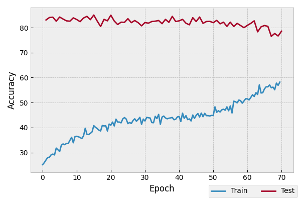
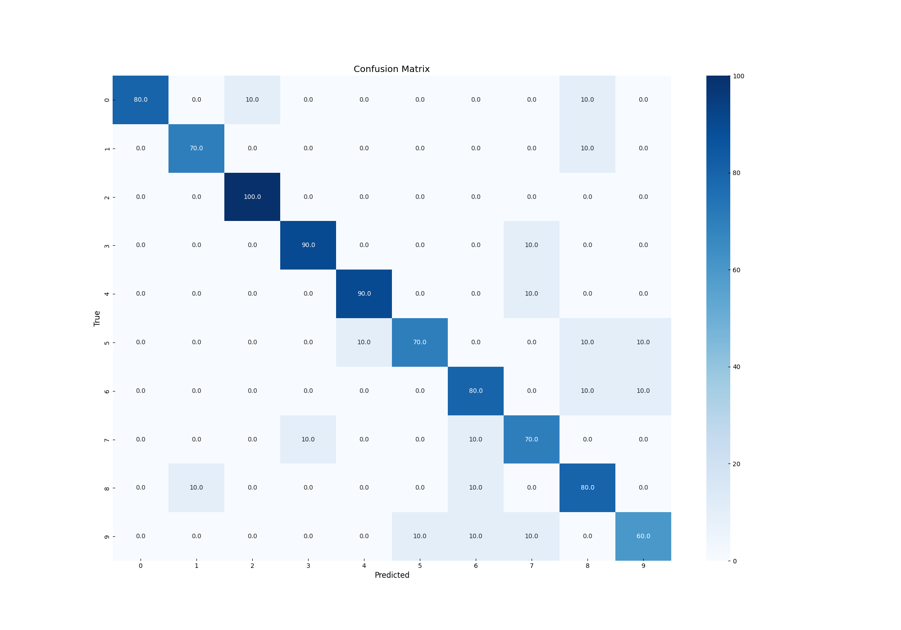

# Mnist - MAML

This project implements a N-way k-shot on MNIST dataset.
There are num_classes classes in the training set which consists of MNIST samples rotated by an angle.
The test set consists of the real dataset MNIST with the true labels.

### MSR (ConvNet sans dropout)

Avec les paramètres par défaut mais avec un num_inner_steps=7 :  

### MAML (ConvNet (avec dropout))

Avec les paramètres par défaut mais avec un num_inner_steps=7 : 

### MAML (ConvNet sans dropout)

Avec les paramètres par défaut : 

### MAML (SimpleNN)

Avec les paramètres par défaut : 

